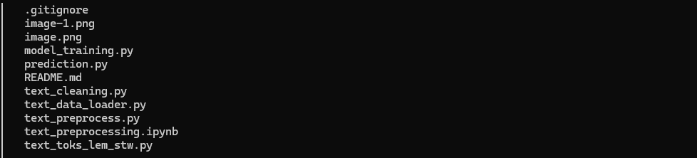
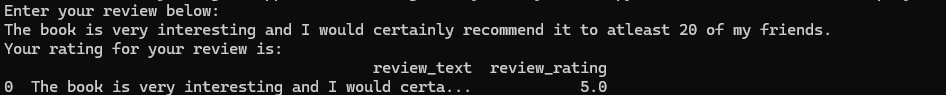
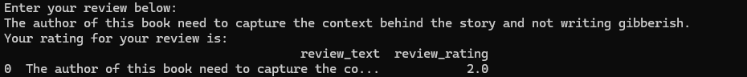

#### BOOK REVIEW AND RATING USING NATURAL LANGUAGE PROCESSING

###### PROJECT SUMMARY
This work demonstrated the development of text preprocessing workflows and pipelines and the training of NLP models for predicting the ratings on user review.

In the project, a multiphase models were developed to test run on the workflows and pipelines. It is for demonstration purpose.

###### FOLDER STRUCTURE

###### PREDICTION RUN

